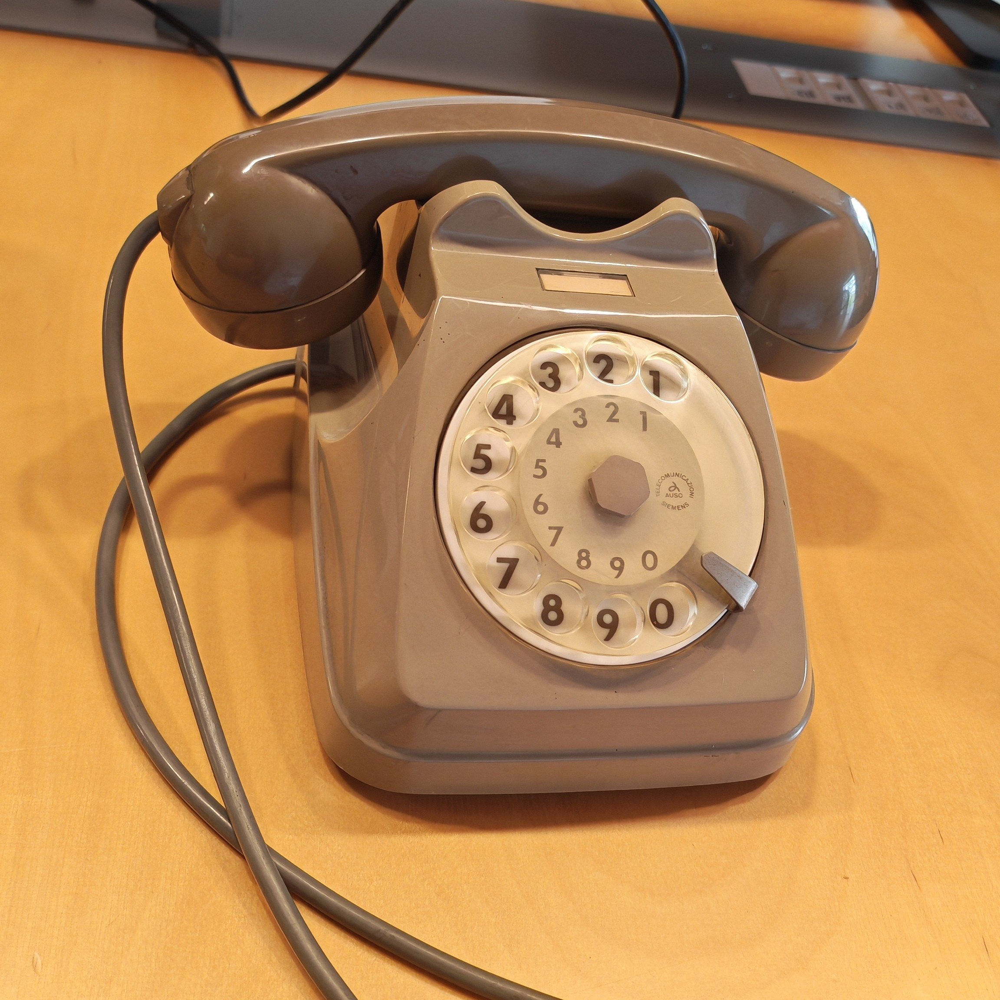

# Siemens S62 Retell Phone



A retro AI phone built around a **Raspberry Pi Zero 2 W** and a restored **Siemens S62** handset/body.

Full project story and build notes on Medium:
https://medium.com/@fabryz/from-a-flea-market-siemens-s62-to-an-ai-phone-204b35eacc12

The idea behind this project is simple: take a classic physical telephone, keep the tactile and mechanical charm of the original object, and connect it to a modern AI voice workflow.

This particular phone was picked up at an antiques / flea market and turned into an experiment in blending **physical, analog interaction** with **digital voice AI**.

For people outside Italy: the **Siemens S62**, commonly nicknamed **"Bigrigio"**, is one of the most recognizable Italian desk telephones of the late SIP era. The model was introduced in **1962**, was designed by **Lino Saltini**, and became the standard rented telephone supplied by **SIP** across Italy for many years. The nickname "Bigrigio" comes from its characteristic two-tone gray color scheme. Later, newer models such as **Pulsar** gradually replaced it, but the S62 remained iconic. 

This repository documents the Raspberry Pi side of that build: hook detection, audio routing, SIP calling with `pjsua`, and Retell integration.

Retell custom telephony reference:

- https://docs.retellai.com/deploy/custom-telephony

---

## What this project does

The Raspberry Pi:

- monitors the phone hook switch through GPIO
- starts a Retell SIP call when the handset is lifted
- closes the call when the handset is placed back down
- routes audio through ALSA
- can record local WAV files for debugging
- can run automatically on boot with `systemd`

At the current stage, the project already supports **live AI phone calls** through Retell and `pjsua`.

---

## Hardware used

This repository is built specifically around:

- **Raspberry Pi Zero 2 W**
- **Siemens S62** desk telephone
- **INMP441** I2S MEMS microphone, used instead of the original carbon microphone capsule
- **MAX98357A** I2S DAC / amplifier, used to drive the handset speaker from the Raspberry Pi
- handset hook switch connected to GPIO
- original handset speaker wired through the amplifier path

### Why these modules are used

- The **INMP441** is used because it is much easier and cleaner to interface with the Raspberry Pi than the original carbon microphone.
- The **MAX98357A** is used to convert Raspberry Pi digital audio into a signal suitable for the telephone speaker.

### Audio device note

Depending on the exact hardware wiring and overlays used on your Raspberry Pi, the ALSA device exposed by the system may vary.

In the current working setup documented here, the project uses the ALSA device exposed as:

- `sndrpigooglevoi`

## Wiring notes

The exact wiring can vary depending on how the phone has been restored, but this project currently assumes a Raspberry Pi I2S audio setup plus a GPIO hook switch.

### Hook switch

- Hook switch → `GPIO17` (**physical pin 11**)
- Logic used in software:
  - `LOW` = handset lifted
  - `HIGH` = handset down

### I2S audio bus

The Raspberry Pi PCM / I2S audio bus uses the usual GPIO group:

- `GPIO18` (**physical pin 12**) → I2S bit clock / BCLK
- `GPIO19` (**physical pin 35**) → I2S word select / LRCLK / WS
- `GPIO20` (**physical pin 38**) → I2S data into Raspberry Pi
- `GPIO21` (**physical pin 40**) → I2S data out from Raspberry Pi

### INMP441 microphone

Typical connection:

- `VDD` → **3.3V** (**physical pin 1** or **17**)
- `GND` → any ground pin
- `SCK` → `GPIO18` (**pin 12**)
- `WS` / `LRCL` → `GPIO19` (**pin 35**)
- `SD` → `GPIO20` (**pin 38**)

### MAX98357A amplifier

Typical connection:

- `VIN` → **5V** (**physical pin 2** or **4**)
- `GND` → any ground pin
- `BCLK` → `GPIO18` (**pin 12**)
- `LRC` / `LRCLK` → `GPIO19` (**pin 35**)
- `DIN` → `GPIO21` (**pin 40**)

The speaker inside the Siemens S62 is then connected to the amplifier output.

### Important note

The exact power pins and speaker wiring should always be verified against your real hardware build before copying them into another project.

---

## Current software architecture

Main blocks:

- **Python** application for hook monitoring and call lifecycle
- **Retell** for call registration / AI voice agent handling
- **pjsua** from `pjproject` for SIP audio transport
- **ALSA** for playback/capture routing
- **systemd** for autostart on Raspberry Pi boot

---

## Suggested repository layout

A minimal layout like this is enough:

```text
repo/
├── assets/
├── recordings/
│   └── .gitkeep
├── systemd/
│   └── bigrigio-retell.service
├── .env
├── .env.example
├── .gitignore
├── LICENSE
├── README.md
├── requirements.txt
└── retell_full_duplex.py
```

If you later rename the main Python script, update the `systemd` service and README accordingly.

---

## Python dependencies

Install Python dependencies from `requirements.txt`.

On Raspberry Pi OS / Debian, if you are **not** using a virtual environment:

```bash
pip install --break-system-packages -r requirements.txt
```

Useful inspection commands:

```bash
pip list --not-required
pip freeze
```

---

## Environment variables

Create a `.env` file in the repository root.

Example:

```dotenv
RETELL_API_KEY=your_retell_api_key
RETELL_AGENT_ID=your_retell_agent_id
HOOK_PIN=17
PJSUA_BIN=pjsua-raspi
PJSUA_STUN_SERVER=stun.l.google.com:19302
PJSUA_CAPTURE_DEV=
PJSUA_PLAYBACK_DEV=
```

Notes:

- `RETELL_API_KEY`: Retell API key
- `RETELL_AGENT_ID`: Retell agent identifier
- `HOOK_PIN`: GPIO pin used for the hook switch
- `PJSUA_BIN`: executable name or path for `pjsua`
- `PJSUA_STUN_SERVER`: STUN server used for one-way audio / NAT traversal scenarios
- `PJSUA_CAPTURE_DEV`: optional explicit ALSA capture device index for `pjsua`
- `PJSUA_PLAYBACK_DEV`: optional explicit ALSA playback device index for `pjsua`

Leaving `PJSUA_CAPTURE_DEV` and `PJSUA_PLAYBACK_DEV` empty lets `pjsua` use the ALSA default device.

---

## Build and install `pjsua`

This project expects `pjsua` to be present on the Raspberry Pi.

### 1. Clone `pjproject`

```bash
git clone https://github.com/pjsip/pjproject.git
cd pjproject
```

### 2. Install build dependencies

```bash
sudo apt update
sudo apt install -y \
  build-essential \
  pkg-config \
  libasound2-dev \
  libssl-dev \
  libopus-dev \
  libsrtp2-dev
```

### 3. Configure and compile

```bash
./configure
make dep
make -j$(nproc)
```

The resulting binary is usually found under:

```text
pjproject/pjsip-apps/bin/
```

For example:

```text
/home/bigrigio/telefono/pjproject/pjsip-apps/bin/pjsua-aarch64-unknown-linux-gnu
```

### 4. Create a stable symlink

Instead of hardcoding the compiled path inside Python, expose it through a stable command name:

```bash
sudo ln -sf /home/bigrigio/telefono/pjproject/pjsip-apps/bin/pjsua-aarch64-unknown-linux-gnu /usr/local/bin/pjsua-raspi
```

Verify:

```bash
which pjsua-raspi
```

Then use in `.env`:

```dotenv
PJSUA_BIN=pjsua-raspi
```

---

## ALSA setup

This project currently uses the ALSA device exposed as `sndrpigooglevoi` for both playback and capture.

### Verify the device

```bash
aplay -l
arecord -l
```

Expected output should show a device similar to:

- `card 1: sndrpigooglevoi`

---

## Recommended `~/.asoundrc`

This is the current working setup used by the project:

```bash
cat > ~/.asoundrc <<'ASOUNDRC'
pcm.phone_hw {
  type plug
  slave.pcm "plughw:CARD=sndrpigooglevoi,DEV=0"
}

pcm.phone_capture {
  type plug
  slave.pcm "plughw:CARD=sndrpigooglevoi,DEV=0"
}

pcm.phone_softvol {
  type softvol
  slave.pcm "phone_hw"
  control {
    name "PhoneSoftVol"
    card sndrpigooglevoi
  }
  min_dB -50.0
  max_dB 0.0
  resolution 256
}

pcm.!default {
  type asym
  playback.pcm "phone_softvol"
  capture.pcm  "phone_capture"
}

ctl.!default {
  type hw
  card sndrpigooglevoi
}
ASOUNDRC
```

Then reboot the Raspberry Pi.

---

## Test audio locally

Before testing Retell, make sure local ALSA playback and capture work.

### Playback test

```bash
speaker-test -D default -c 1 -r 8000 -t sine -f 1000
```

```bash
aplay -D default /usr/share/sounds/alsa/Front_Center.wav
```

### Raw hardware playback test

```bash
speaker-test -D plughw:CARD=sndrpigooglevoi,DEV=0 -c 1 -r 8000 -t sine -f 1000
aplay -D plughw:CARD=sndrpigooglevoi,DEV=0 /usr/share/sounds/alsa/Front_Center.wav
```

If these tests work but `pjsua` audio does not, the issue is usually in ALSA routing, device selection, NAT traversal, or `pjsua` configuration.

---

## Output volume control

The current ALSA setup exposes a software volume control called:

- `PhoneSoftVol`

Useful commands:

```bash
amixer -D default scontrols
amixer -D default sget PhoneSoftVol
amixer -D default sset PhoneSoftVol 20%
amixer -D default sset PhoneSoftVol 35%
amixer -D default sset PhoneSoftVol 50%
```

This is the preferred way to adjust the phone speaker output at the Raspberry Pi / ALSA level.

Important note:

- player-specific volume flags such as `mpg123 -f` only affect that specific player
- Retell / `pjsua` audio follows the ALSA device path instead
- so for the SIP call audio path, volume should be adjusted through ALSA (`PhoneSoftVol`) or hardware gain / amplifier wiring

---

## Hook switch behavior

Target behavior:

1. lift the handset → start Retell SIP call
2. place the handset back down → stop the call

Current GPIO assumptions:

- `GPIO.setmode(GPIO.BCM)`
- `HOOK_PIN=17` by default
- pull-up enabled
- `LOW` = off-hook / handset lifted
- `HIGH` = on-hook / handset down

If your wiring is inverted, you may need to invert the logic in the script.

---

## Main Python script

The main script:

- loads credentials from `.env`
- monitors the hook GPIO state
- registers a phone call with Retell
- launches `pjsua`
- writes recordings to `recordings/`
- kills the SIP process when the handset goes back on-hook

Current main script name:

```text
retell_full_duplex.py
```

If you later rename it to something like `retell_phone.py`, remember to update:

- `systemd` service file
- README examples
- any local launch commands

---

## Example launch

```bash
python3 retell_full_duplex.py
```

Typical expected flow:

- script starts and waits for hook changes
- handset is lifted
- Retell call is registered
- `pjsua` places the SIP call
- AI audio flows through the handset
- handset is placed back down
- call is terminated cleanly

---

## Recordings

Local recordings are useful for debugging microphone level, routing, and one-way audio issues.

Create the directory if needed:

```bash
mkdir -p recordings
touch recordings/.gitkeep
```

Recordings should not be committed to git.

---

## Systemd autostart

Example service file:

```ini
[Unit]
Description=Bigrigio Retell Handset Service
After=network-online.target sound.target
Wants=network-online.target

[Service]
Type=simple
User=bigrigio
WorkingDirectory=/home/bigrigio/telefono/repo
ExecStart=/usr/bin/python3 /home/bigrigio/telefono/repo/retell_full_duplex.py
Restart=always
RestartSec=2

[Install]
WantedBy=multi-user.target
```

Install it:

```bash
sudo cp systemd/bigrigio-retell.service /etc/systemd/system/
sudo systemctl daemon-reload
sudo systemctl enable --now bigrigio-retell.service
```

Check logs:

```bash
systemctl status bigrigio-retell.service
journalctl -u bigrigio-retell.service -f
```

---

## Recommended `.gitignore`

```gitignore
__pycache__/
*.pyc
*.pyo
*.pyd
.env
recordings/*.wav
recordings/*.mp3
recordings/*.pcap
recordings/*.txt
*.log
.DS_Store
```

Keep `recordings/.gitkeep` committed.

---

## Troubleshooting notes

A few practical notes from real-world testing on this build:

- one-way audio may appear depending on NAT / home router behavior
- in some setups, enabling STUN was necessary to get two-way audio working reliably
- `pjsua` may work better at `8000 Hz` with `PCMU` forced
- the local WAV recording can reveal very low microphone level even when the live AI transcript still works
- ALSA default routing matters more than individual player settings
- software volume may not always affect every path equally if playback bypasses the intended ALSA softvol layer

Useful debugging tools:

```bash
tcpdump -ni any udp port 4000 or udp port 4001
```

```bash
pjsua --help
```

Retell SIP debugging reference:

- https://docs.retellai.com/reliability/debug-calls-pcap

---

## Future work

Planned improvements:

- rotary dial pulse decoding
- mapping dialed numbers to actions / agents / destinations
- better speaker output volume control consistency
- better microphone gain and capture level tuning
- more robust startup / recovery behavior
- cleaner separation between hardware config and application logic

---

## License

This project is released under the **MIT License**.

Use it, modify it, and share it — but keep attribution.
See the `LICENSE` file for details.

---

## Author

Created and authored by **Fabrizio Codello**.

---

## Support

This project was built as a personal side project and documented to make this kind of retro phone / voice AI build easier for others.

If you found the repository or the article useful, you can support my work here:

[](https://ko-fi.com/fabryz)

Thank you, it helps me keep building, documenting, and sharing projects like this.
